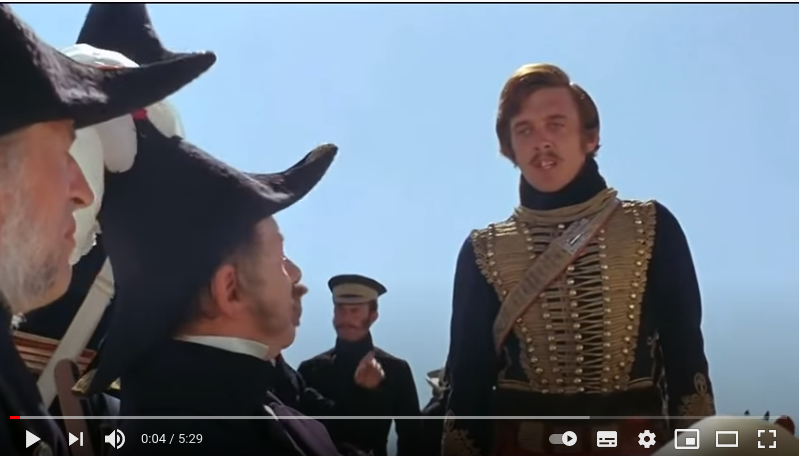

```{r setup, include=FALSE}
knitr::opts_chunk$set(echo = TRUE)
```

## Crimean War

Waged from 1853 to 1856 between Russian Empire and the coalition
of Turkey, France, Great Britain and the Kingdom of Sardinia. Won by
a coalition, but with shockingly large losses (0.5 million soldiers)

The first modern war. Thanks to the invention of the telegraph
and photography (Roger Fenton https://pl.qaz.wiki/wiki/Roger_Fenton
or https://en.wikipedia.org/wiki/Roger_Fenton; or enter Roger + Fenton + camera in the search engine) broadcasted live to the metropolis.

Also famous for an episode known as **The Charge of the Light Brigade**
(https://en.wikipedia.org/wiki/Charge_of_the_Light_Brigade)

[](https://www.youtube.com/watch?v=jomcECjuYa0)

## Florence Nightingale

As it often happend during a war a mess and incompetence was the main source of losses.
The wounded and sick soldiers were transported to Turkey, but
due to poor medical care the mortality among them was huge, and most died
from diseases like typhus, not from battlefield wounds.

Florence Nightingale organized and reformed care for wounded soldiers
while fighting the resistance military bureaucracy (Üsküdar hospital near Istanbul).
It is believed that many soldiers owed their lives to her.

Moreover, and it is as important as her nursing activity, she
collected data about her patients and analysed it.

Nightingale diagrams in particular are famous, and while they haven't
proven to be particularly useful, not every new idea is immediately
brilliant:


It is kind of a bar chart except that there are pie slices instead of bars.
There are twelve slices as many as months.
The length of the radius and hence the area of the slice depends on the size of the phenomenon,
which it represents (cause of death: wounds / diseases / other)

In 1859, Nightingale was elected the first female member of the Royal Statistical Society
and became an honorary member of the American Statistical Association.
To this day, new nurses
they take the **Nightingale Oath** (similar to **Hippocratic Oath** of physicians),
and her birthday -- May 12 -- was made International Nurses Day.

Nightingale elevated the status of the nursing profession, which was considered
a low class job (next to a prostitution or so)

## R

`HistData` package recreates data collected by Nightingale.
The collection includes 24-month observations on 10 variables:

* Date / Month / Year -- date, month, year;

* Army -- average size of the British Corps;

* Disease / Wound / Other - deaths caused by diseases, from combat wounds
or for other reasons;

* Disease.rate / Wounds.rate / Other.rate -- per 1000 deaths


```{r, echo=FALSE}
library("HistData")
require("ggplot2")
library("reshape")

data(Nightingale)

# For some graphs, it is more convenient to reshape death rates to long format
# keep only Date and death rates
require(reshape)
Night<- Nightingale[,c(1,8:10)]

melted <- melt(Night, "Date")
names(melted) <- c("Date", "Cause", "Deaths")
melted$Cause <- sub("\\.rate", "", melted$Cause)
melted$Regime <- ordered( rep(c(rep('Before', 12), rep('After', 12)), 3),
levels=c('Before', 'After'))
Night <- melted
# subsets, to facilitate separate plotting
Night1 <- subset(Night, Date < as.Date("1855-04-01"))
Night2 <- subset(Night, Date >= as.Date("1855-04-01"))
# sort according to Deaths in decreasing order, so counts are not obscured [thx: Monique Graf]
Night1 <- Night1[order(Night1$Deaths, decreasing=TRUE),]
Night2 <- Night2[order(Night2$Deaths, decreasing=TRUE),]
# merge the two sorted files
Night <- rbind(Night1, Night2)

# Before plot
cxc1 <- ggplot(Night1, aes(x = factor(Date), y=Deaths, fill = Cause)) +
# do it as a stacked bar chart first
geom_bar(width = 1, position="identity", stat="identity", color="black") +
# set scale so area ~ Deaths
scale_y_sqrt()
# A coxcomb plot = bar chart + polar coordinates
cxc1 + coord_polar(start=3*pi/2) +
ggtitle("Causes of Mortality in the Army in the East") +
xlab("")
```
In March 1855, as a result of the *Sanitary Commissioners*,
sanitary conditions improved as shown in the chart:


```{r, echo=FALSE}
## #########
# After plot

cxc2 <- ggplot(Night2, aes(x = factor(Date), y=Deaths, fill = Cause)) +
geom_bar(width = 1, position="identity", stat="identity", color="black") +
scale_y_sqrt()
cxc2 + coord_polar(start=3*pi/2) +
ggtitle("Causes of Mortality in the Army in the East") +
xlab("")

```

## Links

`HistData` package
https://cran.r-project.org/web/packages/HistData/HistData.pdf

Nightingale Florence
*Mortality of the British Army, at Home and Abroad, 
and During the Russian War as Compared with the Civil Population in England*, Harrison&Sons, London 1858,
(Scan:
https://archive.org/details/mortalityofbriti00lond)

McDonald Lynn,
*Florence Nightingale, statistics and the Crimean War*,
Journal of the Royal Statistical Society Series A (Statistics in Society),
September 2013,
177(3)
(Copy here: https://github.com/knsm-psw/FlorenceNightingale)
