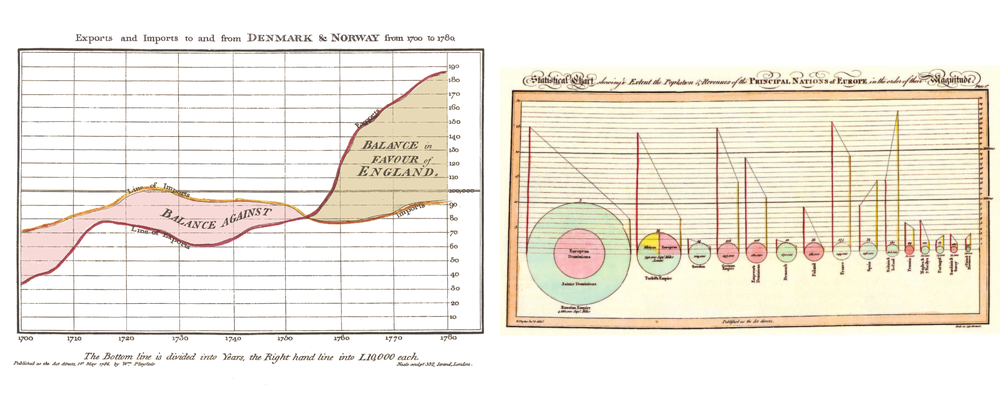
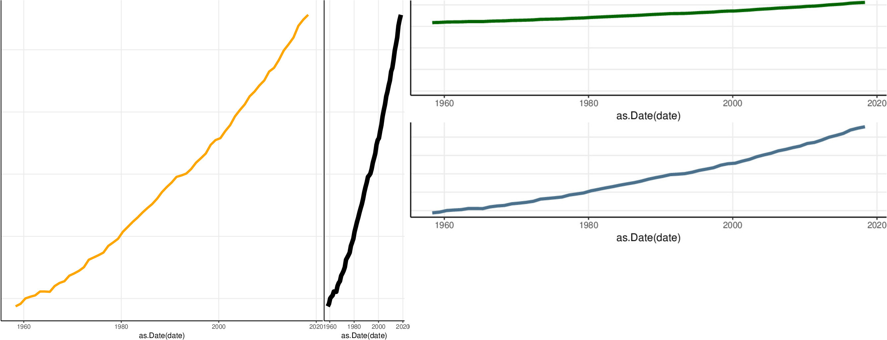
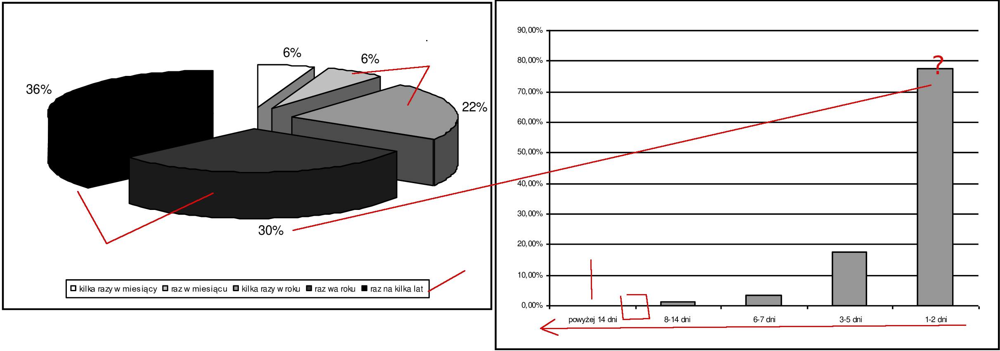
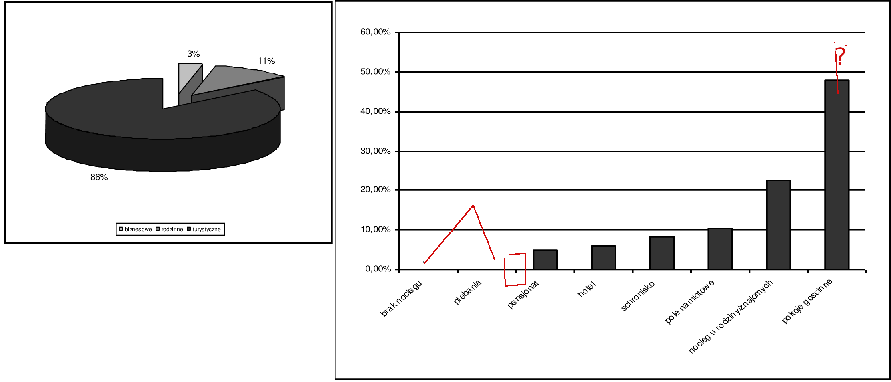
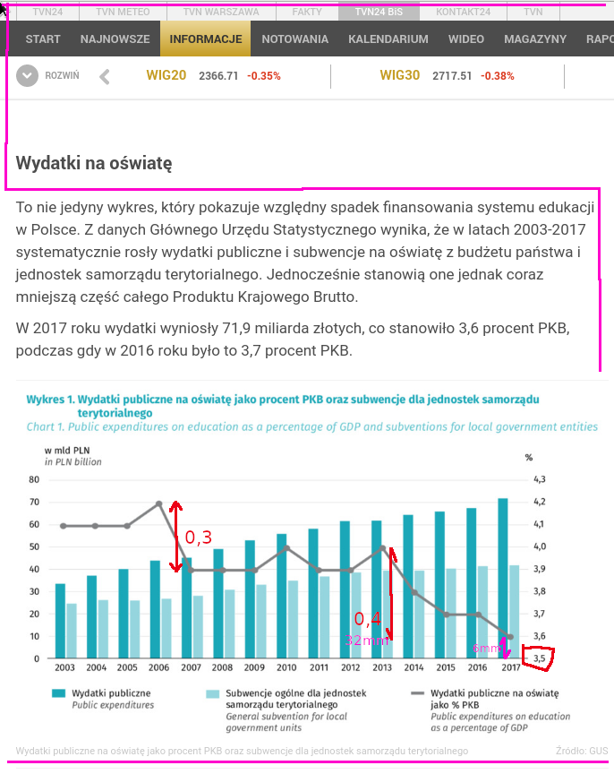
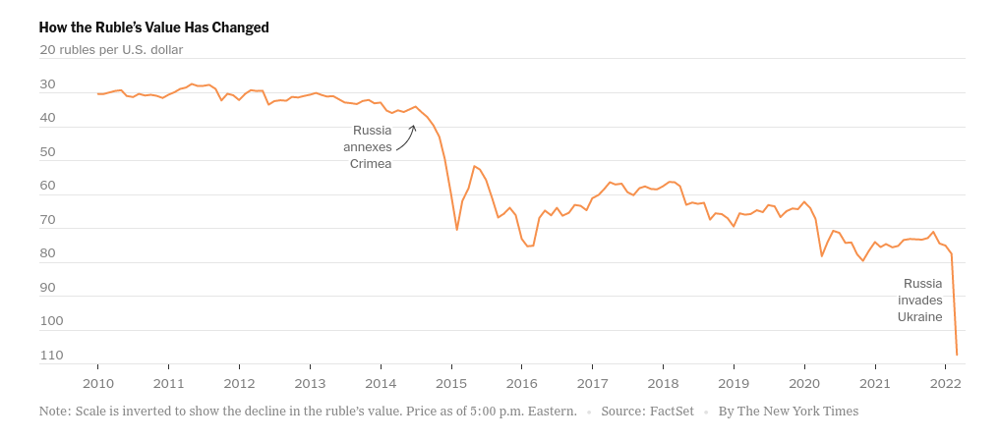

```{r setup, include=FALSE }
knitr::opts_chunk$set(echo = F, warning=F)

library(ggplot2)
library("dplyr")
library("tidyr");
library("tidyverse")
library("RColorBrewer")
library("ggpubr")
```

## W kwestii tytułu

Darrell Huff. How to lie with statistics (142 strony/a5)


https://www.gatesnotes.com/About-Bill-Gates/Summer-Books-2015?WT.mc_id=05_19_2015_SummerBooks_GeekWire

BTW: to zdjęcie (z 2015 roku) w połączeniu z faktem, że Gates finasował badania
w dziedzinie epidemiologii (na John Hopkins Univesity) stało się „dowodem” 
iż za pandemią COVID19 stał Gates

A book written by Darrell Huff in 1954 presenting an introduction to
statistics for the general reader.  Not a statistician, Huff was a
journalist [...]
     
In the 1960/1970s, it became a standard textbook introduction to
the subject of statistics for many college students [...]
one of the best-selling statistics books in history.

https://en.wikipedia.org/wiki/How_to_Lie_with_Statistics
     
Książeczka składa się z 10 rozdziałów i jest napisana w prowokacyjny,
sposób (nienaukowy). Poszczególne rozdziały można powiedzieć przeszły
do legendy i jak się wpisze tytuł rozdziału do google to zwykle można znaleźć
setki tysięcy stron cytujących...

r1.  niereprezentatywność próby;

r2. sztuczki nt. średniej r3: niejasne/nieznane szczegóły wyników analizy
(statystycznie nieistotne rezulataty ogłaszane bez podania, że są
nieistotne--albo średnie dla rozkładów daleko różnych od normalnych)

r4. to samo co #r3 przy założeniu że pomiar jest mocno przybliżony

r5. zmyłkowe wykresy (nie zaczynające się od zera)
     https://en.wikipedia.org/wiki/Gee_Whiz →
     https://en.wikipedia.org/wiki/Misleading_graph

r6. zmyłkowe wykresy (porównywanie jednowymiarowych wielkości w 2D albo 3D)
     https://thejeshgn.com/2017/11/17/how-to-lie-with-graphs/
     r7: using one thing as a way to claim proof of something else, 
     even though there's no correlation between the two 
     (teza i dowód nie są ze sobą powiązane)
     https://www.secjuice.com/the-semi-attached-figure/

r8. Korelacja to nie przyczynowość

r9. Misinforming people by the use of statistical material 
     might be called statistical manipulation, in a word, Statisticulation.
     (ten rozdzialik to podsumowanie)

10. Jak się nie dać oszukać:

Who Says So? (ludzie mają interesy);
     
How Does He Know? (pomiar jest często wysoce wadliwy);
     
What’s Missing? (analiza jest niejasna/niepełna);
     
Many figures (liczb nie rysunków) lose meaning because a comparison
is missing. Kobiety w PL nie rodzą dzieci; przeciętny wiek matki
w momencie urodzenia dziecka to 27 lat.
[czego NIE powiedziano: W całej Europie tak jest]

Did Somebody Change The Subject? (czy mówimy o tezie?)
     
Does It Make Sense? (ogólnie czy coś z tego wynika na poziomie zdrowego rozsądku)

**Że ludzie pokładają nadmierną ufność wynikom statystycznym to zjawisko znane i komentowane od lat:**


* There are 3 kinds of lies: lies, damned lies and statistics (ogólnie znana sentencja)

* Despite its mathematical base, statistics is a much an art as it is a science (Huff s. 120;
dużo mniej znane bo książka Huffa w PL nie jest specjalnie znana)

* pigs had to expend enormous labours every day upon mysterious things called "files," "reports," "minutes," and "memoranda."
These were large sheets of paper which had to be closely covered with writing, and then,
they were burnt in the furnace. (Animal Farm/Orwell; świnie były Statystykami moim zdaniem :-) )

**Wprowadzające w błąd analizy statystyczne mają się mimo to całkiem dobrze** jeżeli nie lepiej niż za czasów Huffa
co pewnie wynika z następujących czynników:

* wzrosła liczba statystyków, często amatorów (każdy może dziś coś łatwo policzyć)

* wzrosła liczba łatwo dostępnych danych

* przynajmmniej w PL edukacja statystyczna omija ten ciemny aspekt statystyki.
(Studenci są generalnie uczeni różnych metod analizy danych, a sprawy wątpliwego pomiaru są pomijane,
co daje fałszywe wrażenie wysokiej wiarygodności wyników podczas gdy 
jak wiemy obowiązuje **GiGo**.)


**Nie tylko wykresami można wprowadzić w błąd** (w sposób zamierzony lub nie)
ale ten wykład jest o wykresach. Bo wykresy są powszechne. 
Bo wykresy statystyczne stały się ulubioną formą prezentacji wyników przez media w tym media elektroniczne i społecznościowe (jesteśmy zalewani wykresami, które mają coś udowodnić.)
Bo nie można na raz o wszystkim. 

## Po co są tworzone wykresy statystyczne?

Wykresy statystyczne można tworzyć w następujących trzech celach:

1. **Dekoracjnym** (aby przyciągnąć czyjąś uwagę; dokument bez obrazków jest nudny,
kolorowe zdjęcia są lepsze niż biało-czarne;
fantazyjne rysunki są lepsze niż proste, *forma jest królem, treść nie ma znaczenia*)

2. **Objaśniającym** (aby lepiej wyjaśnić komuś pewne zjawisko.
Uważa się, że obraz jest warty tysięcy słów)

3. **Eksploracyjnym** (wyszukiwanie wzorców danych na eksploracyjnym/wstępnym etapie analizy danych)

Skoncentruję się na drugim punkcie, tj. na **skutecznych** (effective) graficznych
metodach objaśniania zależności w danych. Przy czym jedna metoda (graficzna) jest bardziej **skuteczna** niż inna, jeśli zawarta
w niech informacja jest sprawniej/łatwiej odczytywana przez odbiorcę [Robbins 2005]


## Rodzaje wykresów

Niektóre wykresy są lepsze od innych:

* **Zalecane**: wykresy punktowe, wykresy słupkowe, wykresy liniowe, histogramy , wykresy paskowe (stripcharts),
panele (zamiast ułożonych skumulowanych słupków lub wykresów wieloliniowych),
wykresy rozrzutu (dwie zmienne)

* **Niezalecane**: wykresy kołowe, wykresy bąbelkowe, skumulowane wykresy słupkowe, wykresy wieloliniowe


## Kącik historyczny

Wykresy słupkowe/liniowe/kołowe zostały wymyślone przez Williama Playfaira (ekonomista!) w XVIII wieku.
Wykresy kropkowe wymyślił John Cleveland (lata 80.).
Wykresy pudełkowe zaproponował John Tukey (lata 70.)



Więcej wykresów Playfaira można znaleźć za pośrednictwem google lub w
[artykule Syamnzika] (http://www.math.usu.edu/symanzik/papers/2009_cost/editorial.html)

Statystyką zajmowała się też Florence Nightingale. Wykres poniżej nazywa się
różą Nightingale. Jest to rodzaj skumulowanego wykresu słupkowego, ale w układzie biegunowym.


Wycinków (biegunowych słupków) jest dwanaście -- tyle ile miesięcy.
Długość promienia a co za tym idzie wielkość pola wycinka zależy od wielkości zjawiska,
który reprezentuje (liczba zmarłych z powodu: ran, chorób oraz innych przyczyn)
Diagramy FN nie przyjęły się, no ale nie każdy nowy pomysł jest od razu genialny...


## Metafory graficzne (graphic features)

Wizualizacja danych = zakodowanie zależności między liczbami (aka informacji ilościowej) za pomocą **metafor graficznych** (figury geometryczne,
kąty, kolory, położenie itp.). Niektóre metafory są lepsze niż inne (z punktu widzenia skuteczności)


Wg William S. Cleveland (tego od stripcharts) oraz  Robert McGill (*Graphical Perception: Theory, Experimentation,
and Application to the Development of Graphical Methods*, JASA 1984) uporządkowali
**metafory graficzne** w następującej kolejności (od najskuteczniejszej do najmniejskutecznej)

* Położenie na jednakowej skali i wspólnej **linii bazowej**

* Położenie na jednakowej skali 

* Długość

* Kąt

* Powierzchnia

* Objętość (OK pseudo 3D)

* Kolor (odcień), kolor (nasycenie), kolor (gęstość czerni)

Może zaskakiwać niska efektywność koloru, ale pokażemy że tak jest w istocie.

Najbardziej efektywna jest ocena położenia (odległości) na
jednakowej skali i wspólnej linii bazowej

Ocena wielkości kąta nie jest precyzyjna (trudno jest porównać zatem dwa kąty niewiele się różniące).
Kąty ostre są niedoszacowane podczas gdy kąty rozwarte (większe niż 90) są przeszacowane.

Ocena powierzchni jest równie mało precyzyjna.
Niemożliwe jest rozróżnienie obiektów o zbliżonej powierzchni

## Jedna zmienna

### Zmienna niemierzalna: wykresy kołowe i słupkowe

Przykład: Noclegi udzielone w roku 2017 wg krajów UE (tour_occ_ninat, 
*Nights spent at tourist accommodation establishments by non residents*)


```{r message=F, echo=F, warning=F, fig.width=10}
# https://www.datanovia.com/en/blog/how-to-create-a-pie-chart-in-r-using-ggplot2/
df <- data.frame( class=c("Spain", "UK", "Italy", "France", "Greece",
    "Austria", "Germany", "Croatia", "Portugal", "Netherlands", "Rest28"),
    n=c(305907462, 213378155, 210658786, 133499991, 89284386, 86044321, 83111219,
        80176804, 48884842, 44169041, 202635615));

sum.eu <-sum(df$n)
df["prop"] <- df$n / sum.eu * 100;
df["txt.prop"] <- sprintf ("%.1f", df$prop);

df <- df %>%
  arrange(desc(class)) %>%
  mutate(ypos = cumsum(prop) - 0.5*prop)

mycols <- brewer.pal(13, "Set3")

pc1 <- ggplot(df, aes(x = "", y = prop, fill = class)) +
  geom_bar(width = 1, stat = "identity", color = "white") +
  coord_polar("y", start = 0)+
  scale_fill_manual(values = mycols) +
  ggtitle("Total nights spent by country") +
  theme_void()

pc2 <- ggplot(df, aes(x = "", y = prop, fill = class)) +
  geom_bar(width = 1, stat = "identity", color = "white") +
  coord_polar("y", start = 0)+
  geom_text(aes(y = ypos, label = txt.prop), color = "black")+
  scale_fill_manual(values = mycols) +
  ggtitle("Total nights spent by country") +
  theme_void()

## dot-plot
pc3 <- ggplot(df, aes(x = reorder(class, n) )) +
  geom_point(aes(y = prop, colour = 'prop' ), size=3) +
  xlab(label="#") + ylab(label="% ") + coord_flip()+
  ggtitle("Total nights spent by country") +
  theme(plot.title = element_text(hjust = 0.5))

## bar chart
pc4 <- ggplot(df, aes(x = reorder(class, n), y=prop)) +
  geom_bar(stat="identity", fill = 'navyblue' ) +
  xlab(label="#") + ylab(label="% ") +
  coord_flip()+ 
  ggtitle("Total nights spent by country") +
  theme(plot.title = element_text(hjust = 0.5))
```

Wykresy kołowe:

```{r  message=F, echo=F, warning=F, fig.width=10}
ggarrange(pc1, pc2, ncol = 2, nrow = 1)
```

Wykresy słupkowe:

```{r  message=F, echo=F, warning=F, fig.width=10}
ggarrange(pc3, pc4, ncol = 2, nrow = 1)
```

### Zmienna mierzalna: histogram

Histogram służy do wizualizacji rozkładu częstości. Pary wartość/liczebność
są pokazywane jako prostokąty umieszczone w układzie współrzędnych. Zwykle wartości są grupowane
w **przedziały wartości**.

Przykład: wiek laureatów Nagrody Nobla (do roku 2018 włącznie;
 dane: [The Nobel Prize API Developer Hub](https://nobelprize.readme.io/))

```{r, cache = F, dependson = "pl_hotel_data"}
##d <- read.csv("powiaty_wskazniki_woj_regiony.csv", sep = ';',  header=T, na.string="NA");
nlf <- read.csv("nobel_laureates3.csv", sep = ';', dec = ",",  header=T, na.string="NA");
noblisci <- nrow(nlf)

ggplot(nlf, aes(x = age)) +
  geom_histogram(bins = nclass.Sturges(nlf$age), fill='forestgreen', color='aquamarine') +
  geom_text(aes(y = 150, x = 20, label = sprintf("n = %i", noblisci) ), color = "black")
```

Histogramy o szerokości przedziału równej 10, 5, 2 oraz 1 lat:

```{r, cache = F, echo=F, dependson = "pl_hotel_data"}
#library(ggpubr)
p1 <- ggplot(nlf, aes(x = age)) +
  geom_histogram(binwidth = 10, fill='forestgreen')
p2 <- ggplot(nlf, aes(x = age)) +
  geom_histogram(binwidth = 5, fill='forestgreen')
p3 <- ggplot(nlf, aes(x = age)) +
  geom_histogram(binwidth = 2, fill='forestgreen')
p4 <- ggplot(nlf, aes(x = age)) +
  geom_histogram(binwidth = 1, fill='forestgreen')

ggarrange(p1,p2,p3,p4)
```

Im więcej wartości/przedziałów tym histogram jest bardziej szczegółowy co niekoniecznie
jest pożądane bo zaciemnia ogólny obraz. Nie ma złotych recept na to ile powinno być przedziałów,
a ich liczba determinuje kształt oraz optyczną wielkość (tj. całkowitą powierzchnię).
Im mniej przedziałów tym histogram będzie optycznie większy.

## Porównanie rozkładów

### Cecha niemierzalna

Standardowe podejście:
skumulowany wykres słupkowy (*stacked barchart*) względnie grupowany wykres słupkowy (*multiple barchart*)

CBOS realizuje co najmniej 12 razy w roku
sondaż "Aktualne problemy i wydarzenia", na reprezentatywnej ok. 1000-osobowej próbie dorosłych mieszkańców Polski. (cf https://www.cbos.pl/PL/trendy/trendy.php?)

```{r, cache = F, echo=F, message=F, warning=FALSE}
dA <- read.csv("zaufanie_do_politykow_CBOS_2019.csv", sep = ';',  header=T, na.string="NA");

## kto;zaufanie;diffz;nieuf;diffn;obojetnosc;nieznajomosc

## https://stackoverflow.com/questions/17148679/construct-a-manual-legend-for-a-complicated-plot
cols <- c("zaufanie"="blue","nieufnosc"="red","nieznajomosc"="black")

### https://www.guru99.com/r-dplyr-tutorial.html#9
### Ordering factor
dA$sortOrder <- dA$zaufanie

dB <- dA %>% gather(aspekt, vv, zaufanie:nieznajomosc) %>% 
   filter(aspekt=="zaufanie" | aspekt =="nieuf" | aspekt == "nieznajomosc") %>% as.data.frame

## stacked barchart
p2 <- ggplot(dB, aes(x = reorder(kto, sortOrder), y=vv, fill=aspekt )) +
  ggtitle("Zaufanie do polityków 1/2019") +
  theme(legend.position="top") +
  xlab(label="") + 
  ylab(label="") + 
  geom_bar(position="stack", stat="identity") +
  coord_flip()
##p2

## grouped
p2dodge <- ggplot(dB, aes(x = reorder(kto, sortOrder), y=vv, fill=aspekt )) +
  ggtitle("Zaufanie do polityków 1/2019") +
  theme(legend.position="top") +
  xlab(label="") + 
  ylab(label="") + 
  geom_bar(position="dodge", stat="identity") +
  coord_flip()
##p2dodge
 
## Faceted piechar
## http://zevross.com/blog/2019/04/02/easy-multi-panel-plots-in-r-using-facet_wrap-and-facet_grid-from-ggplot2/
p3x <- ggplot(dB, aes(x = "", y=vv, fill=factor(aspekt))) + 
  ggtitle("Zaufanie do polityków 1/2019") +
   theme(legend.position="top") +
  xlab(label="") + 
  ylab(label="") + 
  facet_wrap(~kto, ncol=8) + 
  geom_bar(width = 1,position = "fill", stat="identity") + 
  coord_polar(theta="y")
##p3x

## Faceted barchart
p3A <- ggplot(dB, aes(x =kto , y=vv, fill=aspekt )) +
  ggtitle("Zaufanie do polityków 1/2019") +
  theme(legend.position="top") +
  xlab(label="") +
  ylab(label="") +
  facet_wrap(~aspekt) +
  geom_bar(stat="identity") +
  coord_flip()
##p3A

```

Częścią tych badań jest badanie zaufania do Polityków. Które to zaufanie
jest mierzone w taki sposób, że respondenci odpowiadają na jedno pytanie,
które brzmi:
*Ludzie aktywni publicznie – swoim zachowaniem, tym, co mówią,
do czego dążą – budzą mniejsze lub większe
zaufanie. Przedstawimy teraz Panu(i) listę osób aktywnych w życiu politycznym naszego kraju.
O każdej z nich proszę powiedzieć,
w jakim stopniu budzi ona Pana(i) zaufanie. Odpowiadając,
proszę posłużyć się skalą, na której –5 oznacza, że osoba ta budzi
w Panu(i) głęboką nieufność, 0 – że jest ona Panu(i) obojętna,
a +5 oznacza, że ma Pan(i) do tej osoby pełne zaufanie. Oczywiście
może się Pan(i) posługiwać innymi ocenami tej skali. Jeżeli kogoś Pan(i) nie zna, proszę powiedzieć*

Odsetki badanych wyrażających zaufanie – wskazania punktów od +1 do +5,
nieufność – wskazania punktów od –1 do –5,
obojętność – 0

W zestawieniu CBOS pomija odpowiedzi „trudno powiedzieć” 
i odmowy odpowiedzi. 

Analiza CBOS (przykład raportu jest 
w pliku `zaufanie_do_politykow_CBOS_2019.pdf`) posługuje się 
skumulowanym wykresem słupkowym (*stacked barchart*):

```{r cache = F, echo=F, message=F, warning=FALSE, fig.width=10}
ggarrange(p2, p2dodge, ncol = 2, nrow = 1)
```

Skumulowany wykres słupkowy jest w zasadzie jest wykresem kołowym,
tyle że zamiast kółek są prostokąty (cf https://eagereyes.org/techniques/stacked-bars-are-the-worst). 
Można łatwo porównywać 
łączną wartość albo wartość przedstawioną za pomocą pierwszego słupka
(bo mają wspólną linię dla wartości zero, *common baseline*).
Pozostałe słupki nie są oparte o wspólną linię zerowej wartości i w związku
z tym porównanie ich wartości jest trudne.
W  przykładzie każdy słupek ma 3 kategorie a już jest trudno 
wskazać czy nieufność do Pawła Kukiza jest większa czy mniejsza od nieufności
do Roberta Biedronia. Gorzej wykres sugeruje, że nieufność do Biedronia
jest większa niż do Kukiza, podczas gdy w rzeczywistości jest odwrotnie.
Podobnie trudno jest określić dla konkretnego polityka
czy zaufanie jest większe od nieufności albo o ile jest większe (lub mniejsze)..

Zamiast kumulować czy grupować można wykreślić
słupki z każdej kategorii oddzielniem na wspólnej linii zera:

```{r cache=F, echo=F, message=F, warning=FALSE}
p3A
```
Takie coś nazywa się panelem. Można zamiast wykresów słupkowych
użyć kołowych (jeżeli ktoś jest jeszcze nieprzekonany że wykres kołowy nie ma żadnych zalet
w porównaniu do słupkowego):

```{r cache = F, echo=F, message=F, warning=FALSE, fig.width=10}
p3x
```

### Cecha mierzalna: wykresy pudełkowe (*box and whisker plot*)

**Wykresy pudełkowe** są znacznie lepsze niż histogramy do porównywania rozkładów.

Konstrukcja (typowego) wykresu pudełkowego: środkowa kreska to mediana. Góra/dół
prostokąta to IQR pierwszy/trzeci kwartyl (czyli  wysokość prostokąta to rozstęp międzykwartylowy.)
Fantazyjne kreski nad/pod prostokątem zwane wąsami
(kot ma *whiskers* a człowiek *mustache*) są definiowane jako $Q_*\pm 1,5 \times \mathrm{IQR}$
Symbole powyżej/pod wąsami (zwykle otwarte kółka) są wartościami nietypowymi (*outliers*)

Zwróć uwagę na sztuczkę: wartości nietypowe nie są definiowane jako (na przykład) górne/dolne
1% wszystkich wartości (bo wtedy **każdy rozkład** miałby outliers);
ale jako wartości mniejsze/większe od $Q_* \pm 1,5 \times \mathrm{IQR}$.
Wszystkie wartości rozkładów o umiarkowanej zmienności mieszczą się wewnątrz czegoś takiego.

Przykład: wiek laureatów Nagrody Nobla

```{r, cache = F, echo=T }
#nlf <- read.csv("nobel_laureates3.csv", sep = ';', dec = ",",  header=T, na.string="NA");
#noblisci <- nrow(lnf)

ggplot(nlf, aes(x=category, y=age, fill=category)) + geom_boxplot() + ylab("years") + xlab("");
```

### Cecha mierzalna: wykresy paskowe (*strip charts*)

Wykres paskowy przedstawia *rozkład* wartości na osi. Taki wykres może być
stosowany zamiast wykresu podełkowego (ponieważ zachowują więcej informacji o danych).


Przykład: wiek laureatów Nagrody Nobla

```{r, cache = F, echo=F, dependson = "pl_hotel_data", fig.width=10}
p4<-ggplot(nlf, aes(x=category, y=age)) +
   geom_jitter(position=position_jitter(0.0), cex=.2, color='forestgreen') +
  theme(axis.text = element_text(size = 5))

p3<-ggplot(nlf, aes(x=category, y=age)) +
  geom_point(alpha = 1/20, color='darkorange2') +
  theme(axis.text = element_text(size = 5))
  #geom_point(size = .3)
  #geom_jitter(position=position_jitter(0.05), cex=1.2)
ggarrange(p4,p3, ncol = 2, nrow = 1)
```

Największym problemem związanym z wykresem paskowym jest nakładanie się punktów.
Może to poważnie zniekształcić wykres.

Nie ma dobrego rozwiązania tego problemu, ale istnieje kilka technik, które mogą pomóc:
użyj mniejszych kropek, użyj półprzezroczystych kropek (prawy panel), użyj **jittera**.

Jitter --- mały losowy szum dodany do danych (poniżej; większy *jitter* na prawym panelu)

```{r, cache = F, echo=F, dependson = "pl_hotel_data"}
p1<-ggplot(nlf, aes(x=category, y=age)) +
   geom_jitter(position=position_jitter(0.2), cex=.2, color='forestgreen') +
  theme(axis.text = element_text(size = 5))
   
p2<-ggplot(nlf, aes(x=category, y=age)) +
   geom_jitter(position=position_jitter(0.1), cex=.2, color='darkorange2') +
  theme(axis.text = element_text(size = 7))

ggarrange(p2,p1, ncol = 2, nrow = 1)
```

## Dwie zmienne

Celem wizualizacji jest pokazanie zależności pomiędzy zmiennymi.

Wykres rozproszenia (wykres XY)
Przykład: Spożycie mięsa a GDP (Świat/2013 rok; dane FAO)

```{r, cache = F, echo=F, warning=FALSE}
### Spożycie mięsa a GDP (Świat 2013 rok)

```{r message=FALSE, echo=FALSE}
## Dane FAO/WorldBank
meatCons <- read.csv(file='meatCons_vs_GDP.csv',sep=';',header=T)
ggplot(meatCons, aes(x = gdp2013, y = y2013)) +
  geom_point(color="steelblue", size=1) +
  ggtitle("Przeciętne spożycie mięsa vs GDP (2013)") +
  geom_smooth(method = "lm") +
  geom_smooth(method = "loess", color="red")
```

## Szeregi czasowe

Wykres liniowy lub słupkowy. Liniowy jest bardziej odpowiedni w przypadku
szeregu momentów a słupkowy okresów.

Cel: pokazać dynamikę zmian rośnie/maleje i jak szybko także porównać dynamikę,
czyli ocenić zmiany jednej zmniennej względem drugiej...

```{r echo=F, fig.width=10}
f0lex <- read.csv("demo_mlifetable_tabular.csv", sep = ';',  header=T, na.string="NA" )
countries <- c ('PL', 'DE', 'FR', 'UK', 'IT', 'BE', 'SE', 'FI') ## było

flex <- f0lex %>% filter ( geo %in% countries & sex == "T" & year > 2000 &
                      unit == 'LIFEXP' & age == "Y_LT1")  %>% as.data.frame()

p1 <- ggplot(flex, aes(x=year, y=value, color=geo)) +
 #geom_smooth(method="loess", se=F, span=spanV, size=.4) +
 ggtitle("Oczekiwana długość życia w chwili urodzenia") +
 labs(caption="Eurostat: DEMO_MLIFETABLE") +
 geom_point(size=.8, alpha=.5) +
ylab(label="lata") + xlab(label="") +
  theme(plot.title = element_text(size=10)) +
 geom_line(size=.4)
##p1

countriesx <- c ('PL', 'NO', 'AT', 'TR',  'CZ', 'DE', 'FR', 'UK', 'IT', 
                 'BE', 'SE', 'FI', 'BG', 'LT', 'ES') ## było
flex <- f0lex %>% filter ( geo %in% countriesx & sex == "T" & year > 2000 &
                             unit == 'LIFEXP' & age == "Y_LT1")  %>% as.data.frame()
p2 <- ggplot(flex, aes(x=year, y=value, color=geo)) +
  #geom_smooth(method="loess", se=F, span=spanV, size=.4) +
  ggtitle("Oczekiwana długość życia w chwili urodzenia") +
  labs(caption="Eurostat: DEMO_MLIFETABLE") +
  geom_point(size=.8, alpha=.5) +
  ylab(label="lata") + xlab(label="") +
   theme(plot.title = element_text(size=10)) +
  geom_line(size=.4)
##p2

countriesy <- c ('PL', 'CZ') ## było
flex <- f0lex %>% filter ( geo %in% countriesy & sex == "T" & year > 2000 &
                             unit == 'LIFEXP' & age == "Y_LT1")  %>% as.data.frame()
p3 <- ggplot(flex, aes(x=year, y=value, color=geo)) +
  #geom_smooth(method="loess", se=F, span=spanV, size=.4) +
  ggtitle("Oczekiwana długość życia w chwili urodzenia") +
  labs(caption="Eurostat: DEMO_MLIFETABLE") +
  geom_point(size=.8, alpha=.5) +
  ylab(label="lata") + xlab(label="") +
   theme(plot.title = element_text(size=10)) +
  geom_line(size=.4)
##p3

flex.x <- pivot_wider(flex, names_from = 'geo', values_from = value) %>%
  mutate (diff = PL - CZ)

p4 <- ggplot(flex, aes(x=year, y=value, color=geo)) +
  #geom_smooth(method="loess", se=F, span=spanV, size=.4) +
  ggtitle("Oczekiwana długość życia w chwili urodzenia") +
  labs(caption="Eurostat: DEMO_MLIFETABLE") +
  geom_point(size=.8, alpha=.5) +
  coord_cartesian(ylim = c(0, NA)) +
  ylab(label="lata") + xlab(label="") +
   theme(plot.title = element_text(size=10)) +
  geom_line(size=.4)
##p4

ggarrange(p1, p2, ncol = 2, nrow = 1)
ggarrange(p3, p4, ncol = 2, nrow = 1)
```

## Ogólne zasady projektowe

* Zrozumiała **treść**: Czytelnik/odbiorca wyraźnie **rozumie**, co jest na wykresie:
podane są opisy skal/etykiety/wyjaśnienia (pamiętasz co/kiedy/gdzie?)

* Przejrzysta **forma**: czytelnik/odbiorca wyraźnie widzi to, co jest na wykresie
(bez splątanych linii, nakładających się elementów itp.)


* Wyróżniaj dane, a nie linie siatki, etykiety, zbędne legendy czy bezsensowne strzałki.
Im prościej tym lepiej. 

* Znaczniki i etykiety osi powinny być umieszczone na zewnątrz. Wartości na osi X rosną
zawsze od lewej do prawej, wartości na osi Y od dołu do góry
**nigdy** w odwrotnym kierunku. Nie przesadzaj z liczbą etykiet na osiach.

* Pomyśl jak wykres będzie wyglądał w trybie B-W nawet jeżeli w oryginale jest kolorowy
(bo ktoś może go skserować) lub o połowę mniejszy lub jeszcze mniejszy (smartfon).

* Nigdy nie używaj **więcej** metafor, niż jest wymiarów w zbiorze danych.
Prostokąty na wykresie słupkowym powinny być w jednym kolorze.

* Wykresy 3D to katastrofa. Nikt jeszcze nie widział wykresu 3D który byłby
bardziej czytelny niż jego odpowiednik 2D.

* W miarę możliwości używaj wspólnej linii bazowej. W wykresach liniowych wybieraj optymalne proporcje
(nachylenie 45). Użyj skali logarytmicznej, gdy zakres danych jest
ogromy, nie stosuj przerywanych skal, rozpoczynaj osie 0 
(ale czasami nie). Nie stosuj podwójnych osi, bo to ogromnie komplikuje interpretację.

* Preferuj etykiety zamiast legend. Legendy zmuszają czytelnika do patrzenia tam i z powrotem
podczas studiowania wykresu.
Oczywiście, jeśli nie ma miejsca na (długie) etykiety, użyj legendy.

* Wykresy wieloliniowe generalnie to zły pomysł (różne skale, bałagan,
trudności z oceną różnicy między liniami)


## Zalecenia Edwarda Tufte

Tufte (https://www.edwardtufte.com/tufte/; wym. Tafti), 
który jest -- bo ciągle żyje -- znanym ekspertem (aka **guru**) 
w dziedzinie wizualizacji informacji,
zaproponował dwie reguły, które nazwał współczynnik dane/farba (*data to ink ratio*)
oraz (współ)czynnik zakłamania (*lie factor*).

Farba to wielkość farby drukarskiej użyta do narysowania wykresu. Dane to ta ilość
farby, która służy do narysowania danych. Reguła postuluje, aby współczynnik DI miał jak najwyższą
wartość (tj. zawierał minimum elementów zdobniczych a maksimum danych.)

Krótki video klip, ilustruje zasadę maksymalizacji DI: https://www.youtube.com/watch?v=JIMUzJzqaA8

Współczynnik kłamstwa (LF) jest  definiowany jako względną wielkość czegoś na grafice
do wielkości tego w danych. LF powinno być oczywiście równe 100%. Według Tufte, LF większe niż 105%
lub mniejsze niż 95% oznacza znaczące zniekształcenie.
Tę regułę najlepiej wyjaśnić na przykładzie.

Jak bardzo Hinduski są niższe od innych kobiet?


Wygląda że bardzo, np Łotyszki są $135/31 \approx 4,35$ ponad 4 razy wyższe...

### Przykład nieco bardziej subtelny

Wybory prezydenckie 2015. Wyjaśnienie dla cudzoziemców: ten *gigant* (GG) w środku to nasz **były prezydent**.
Facet obok niego po lewej stronie jest naszym **obecnym prezydentem** Dudą (AD).
Obok Dudy jest była gwiazda rocka Kukiz, czarny koń wyborów (CK).

Oto okładka (lekko zmodyfikowana) wpływowego polskiego tygodnika z maja 2015 roku,
tuż przed wyborami. 
Okładka przedstawia wykres słupkowy tyle że uatrakcyjniony w ten sposób że słupkami są sylwetki
kandydatów. Redakcja twierdzi, że liczby są *in-sync* z wynikami najświeższych badań.

Co można wydedukować z tego wykresu na temat wyników każdego kandydata?
O ile wynik GG jest lepszy od wyniku AD? A od wyniku CK?
Który kandydat jest wspierany przez gazetę (to akurat łatwo :-)?


The lie-factor details:


Linia od butów do czubka głowy 204mm dla GG, 134mm dla AD
dla 42.5mm dla CK. 
Zatem  $204/134=1.5$ oraz $204/42.5 \approx 4.8$. Ponieważ $44/29 \approx 1.5$
oraz $44/9 \approx 4.8$ zatem wartość LF wynosi perfekcyjne 100%.

Ale czy oceniając figury dwuwymiarowe patrzymy tylko na jeden wymiar na czy powierzchnię?

Jeżeli porównamy powierzchnię: $(204 * 58) /(134 * 21)= 4.20$ oraz $(204 *58)/(42.5 *15) \approx 18.56$. LF
wynosi $4.2/1.5 =280$% oraz $18.56/4.8=387$%. Przypomniam że 105% i więcej to dużo wg Tufte...

Na marginesie: żeby poprawić wynik GG zastosowana dwa pozastatystyczne triki
(*Can you see them?*)

Na marginesie 2: Co dokładnie oznacza proporcje postaci i czy nie powinno być wysokość postaci? :-)

## Nachylenie 45 (*banking to 45*)

Stosunek szerokości do wysokości prostokąta nazywany
jest jego współczynnikiem proporcji (aspect ratio).

Współczynnik proporcji określa obszar zajmowany przez dane na wykresie.
Zmiana współczynnika proporcji zmienia postrzeganie wykresu.
Pytanie brzmi: który współczynnik proporcji jest najlepszy?

Ocena wielkości nachylenia krzywej jest najlepsza jeżeli, jeśli jest ono równe 45 stopniom.
Znacznie trudniej jest określić wielkość zmiany, jeśli krzywe są prawie poziome/pionowe.
Cleveland (1988) zaproponował aby współczynnik proporcji wykresu był
tak dobrany, żeby **większość** krzywych była nachylona po kątem około 45 stopni.

Ustawienie współczynnika proporcji tak, aby średnia wartości nachylenia 
wynosiła 45 stopni, nazywa się „przechylaniem średniej orientacji do
45 stopni”.

Można tak ustalić współczynnik proporcji wykresu, aby średnia ważona segmentów linii
(ważona długością segmentów) wynosiła około 45 stopni. Dla programu komputerowego wyliczenie
czegoś takiego nie powinno 
stanowić problemu, ale nie znam takiego, który by coś takiego umiał.

**Ćwiczenie**: na którym wykresie dynamika zjawiska jest największa? (proste)

{width=75%}

BTW: na każdym wykresie są te same dane dotyczące emisji (średnia dla Maja każdego roku.) 
Źródło: US Government's Earth 
System Research Laboratory, Global Monitoring Division. 
(cf [CO2 PPM -- Trends in Atmospheric Carbon Dioxide](https://datahub.io/core/co2-ppm))

```{r, echo=F}
df.co <- read.csv("co2may.csv", sep = ';',  header=T, na.string="NA");
df.co["ave100"] <- df.co$average;


p1 <- ggplot(df.co, aes(x = as.Date(date))) +
  geom_line(aes(y = ave100), colour="pink", size=1.5) +
  ylab(label="co2") +  xlab(label="") +
  labs(colour = "") +
  theme(legend.position="top") +
  theme(legend.text=element_text(size=12));

p0 <- ggplot(df.co, aes(x = as.Date(date))) +
  geom_line(aes(y = ave100), colour="pink", size=1.5) +
  ylab(label="co2") +  xlab(label="") +
  labs(colour = "") +
  theme(legend.position="top") +
  coord_cartesian(ylim = c(0, NA)) +
  theme(legend.text=element_text(size=12));
ggarrange(p1, p0, ncol = 2, nrow = 1)

```


## Wybór skali

Skalę logarytmiczną należy stosować jeżeli wizualizowany zbiór danych
charakteruje duży rozstęp (wartości znacznie się różnią.)
Jako przykład znowu znowu laureaci nagrody Nobla, tym razem
według kraju urodzenia (`bornCountryCode`)...

Wykresy punktowe z wykorzystaniem różnych skal na osi Y (arithmetic, log2 and log10)

```{r, cache = F, echo=F, fig.width=10 }
dA <- read.csv("nobel_laureates3.csv", sep = ';', dec = ",",  header=T, na.string="NA");
##nrow(dA)
dS <-  subset(dA, (! bornCountryCode == "" )) # by country of birth
##nrow(dS) # how many

u <- table(dS$bornCountryCode)
uf <- as.data.frame(u)
##
##
##Wykresy punktowe z wykorzystaniem różnych skal na osi Y (arithmetic, log2 and log10)
##
##
names(uf)[1] = 'country'

lFreq <- log2(uf$Freq)
uf["lfreq"] <- lFreq
pc3 <- ggplot(uf, aes(x = reorder(country, Freq) )) +
  geom_point(aes(y = Freq, colour = 'Freq' ), size=1) +
  xlab(label="cc") + ylab(label="n ") + coord_flip()+
  ggtitle("Number of Nobel laureates by Country") +
  theme(axis.text = element_text(size = 7)) +
  theme(plot.title = element_text(hjust = 0.5, size =8))

pc4 <- ggplot(uf, aes(x = reorder(country, lfreq) )) +
  geom_point(aes(y = lfreq, colour = 'lfreq' ), size=1) +
  xlab(label="cc") + ylab(label="log(n) ") + coord_flip()+
  ggtitle("Number of Nobel laureates by Country") +
  theme(axis.text = element_text(size = 7)) +
  theme(plot.title = element_text(hjust = 0.5, size=8))

llFreq <- log10(uf$Freq)
uf["llfreq"] <- llFreq

pc5 <- ggplot(uf, aes(x = reorder(country, llfreq) )) +
  geom_point(aes(y = llfreq, colour = 'lfreq' ), size=1) +
  xlab(label="cc") + ylab(label="log(n) ") + coord_flip()+
  ggtitle("Number of Nobel laureates by Country") +
  theme(axis.text = element_text(size = 7)) +
  theme(plot.title = element_text(hjust = 0.5, size=8))

ggarrange(pc3, pc4, pc5, ncol = 3, nrow = 1);
```

Dokładne dane (gdyby ktoś był ciekaw):

```{r cache = F, echo=F }
u
```

PL -- 25 noblistów 😊 (głównie Niemców i Żydów urodzonych 
w granicach Cesarstwa Niemieckiego względnie Rosyjskiego)

## Jak się nie dać zmanipulować?

Manipulacja może być **zamierzona** lub nie. Jeżeli wykres jest preparowany pod określoną tezę możemy mówić
o manipulacji, ale jeżeli wykres jest **tylko** niepoprawny, to także może zniekształcić
rzeczywistość czyli ją zmanipulować.

Odpowiedź na tytułowe pytanie
w jednym zdaniu: **nie korzystać (w sensie korzystać z danych) ze złych wykresów**, czyli:

1. przedstawiających nieokreślone wielkości (brak źródła, niejasne definicje, nieokreślone cechy stałe)

2. zbudowanych niezgodnie z regułami sztuki. Jeżeli ktoś nie potrafi skonstruować poprawnie wykresu, to może też
jest równie wiarygodny na innych etapach analizy statystycznej?

3. jawnie manipulatorskich


## Przykłady złych wykresów 

Recenzowana praca na temat ruchu turystycznego w muzeum zamku w Malborku pn
Parzych Krzysztof.
[The determinants of the tourist traffic
 in the castle's museum of Malbork](http://www.ojs.ukw.edu.pl/index.php/johs/article/view/4119/pdf)
 Journal of Education, Health and Sport.
 
Praca ta demonstruje wszystkie szkolne błędy omówione wyżej:

{width=95%}

{width=95%}


```{r, cache = F, echo=F, warning=FALSE, error=FALSE}
#library(ggplot2)
#library(RColorBrewer)
#library(dplyr)
#library(ggarrange)

df <- data.frame( visit.freq=c("every few years", "once a year", "every few months", "once a month", "every few weeks"),
n=c(36,30, 22, 6, 6))

colors <- brewer.pal(10, "Set1");
df["label"] <- sprintf ("%.1f", df$n);

df <- df %>%
  arrange(desc(visit.freq)) %>%
  mutate(ypos = cumsum(n) - 0.5*n)

px1 <- ggplot(df, aes(x = "", y = n, fill = visit.freq)) +
  geom_bar(width = 1, stat = "identity", color = "white") +
  coord_polar("y", start = 0)+
  geom_text(aes(y = ypos, label = label), color = "black", size=3)+
  scale_fill_manual(values = colors, name="Frequency") +
  theme_void()

px2 <- ggplot(df, aes(x = reorder(visit.freq, n), y=n)) +
  geom_bar(stat="identity", fill = 'steelblue' ) +
  xlab(label="#") +
  ylab(label="% ") +
  coord_flip()+
  geom_text(aes(label=n), hjust=1.6, color="white", size=3.0)+
  ggtitle("Frequency...") +
  theme(plot.title = element_text(hjust = 0.5))

dg <- data.frame( visit.freq=c("1--2", "3--5", "6--7", "8 and more"),
n=c(78.9, 18.0, 2.1, 1.0))
dg["lab"] <- sprintf ("%.1f", dg$n);

dg <- dg %>%
  arrange(desc(visit.freq)) %>%
  mutate(ypos = cumsum(n) - 0.5*n)

px88 <- ggplot(dg, aes(x = "", y = n, fill = visit.freq)) +
  geom_bar(width = 1, stat = "identity", color = "white") +
  coord_polar("y", start = 0)+
  geom_text(aes(y = ypos, label = lab), color = "black", size=3)+
  scale_fill_manual(values = colors, name="Frequency") +
  theme_void()

px9 <- ggplot(dg, aes(x = reorder(visit.freq, n), y=n)) +
  geom_bar(stat="identity", fill = 'orange' ) +
  xlab(label="#") +
  ylab(label="% ") +
  coord_flip()+
  geom_text(aes(label=lab), hjust=-.3, color="darkgreen", size=3.0)+
  ggtitle("Length of stay (days)") +
  theme(plot.title = element_text(hjust = 0.5))

dh <- data.frame( visit.freq=c("guestrooms", "family", "camping", "hostel", "hotel", "guesthouse"),
      n=c(48.0, 23, 11, 9.0, 5.4, 3.6))

dh["lab"] <- sprintf ("%.1f", dh$n);

px3<-ggplot(dh, aes(x = reorder(visit.freq, n), y=n)) +
  geom_bar(stat="identity", fill = 'orchid2' ) +
  xlab(label="#") +
  ylab(label="% ") +
  coord_flip()+
  geom_text(aes(label=lab), hjust=-.1, color="darkgreen", size=3.0)+
  ggtitle("Type of accomodation") +
  theme(plot.title = element_text(hjust = 0.5))


px4<-ggplot(dh, aes(x = reorder(visit.freq, n) )) +
  geom_point(aes(y = n, color="blue",show.legend=F), size=3) +
  xlab(label="#") +
  ylab(label="% ") +
  coord_flip()+
  geom_text(aes(y=n, label=lab), hjust=.1, vjust=-.8, color="darkgreen", size=3.0)+
  ggtitle("Share of...") +
  scale_color_discrete(guide=F) +
  theme(plot.title = element_text(hjust = 0.5))

```

wersja bardziej czytelna (jeżeli ktoś upiera się przy wykresach kołowych):

```{r, cache = F, echo=F, warning=FALSE, error=FALSE, fig.width=10}
ggarrange(px1, px88, ncol = 2, nrow = 1);
```

jednak lepiej używać wykresów słupkowych:

```{r, cache = F, echo=F, warning=FALSE, error=FALSE, fig.width=10}
ggarrange(px2, px3, px4, px9, ncol = 2, nrow = 2);
```

### Jeszcze gorzej też można (yes we can:-))

Co to jest? 

{width=90%}
### Wykresy kołowe są znane z bylejakości:


### Wykresy słupkowe też można koncertowo zepsuć 

Rozkład miejsc w Sejmie po wyborach w 2015 r


Zaznaczono dziwny przechył w lewo


## Dlaczego protestowali polscy nauczyciele?

Często pokazywany wykres mający 
przekonać
opinię publiczną, że nauczyciele są dużo gorsi niż kiedyś:
(Przeciętne wynagrodzenie jako % przeciętnego ogółem?)


Wersja poprawione (zaczynające się od zera) nie wyglądają już tak
dramatycznie:


```{r, cache = F, echo=F, warning=FALSE, error=FALSE}
pwp <- read.csv("pwp.csv", sep = ';',  header=T, na.string="NA");

pwp1 <- ggplot(pwp, aes(x = as.Date(date))) +
  geom_point(aes(y = prc), colour="pink", size=1.5) +
  ylab(label="") +
  theme_bw() + theme(panel.border=element_blank(), panel.grid.minor=element_blank(), axis.line = element_line(colour = "black")) +
  coord_cartesian(ylim = c(0, 106)) +
  labs(colour = "") +
  theme(legend.position="top") +
  theme(aspect.ratio=0.4)

pwp2 <- ggplot(pwp, aes(x = as.Date(date))) +
  geom_line(aes(y = prc), colour="pink", size=1.5) +
  ylab(label="") +  xlab(label="") +
  theme_bw() + theme(panel.border=element_blank(), panel.grid.minor=element_blank(), axis.line = element_line(colour = "black")) +
  coord_cartesian(ylim = c(0, 106)) +
  labs(colour = "") +
  theme(legend.position="top") +
  theme(aspect.ratio=0.4)

pwp3 <- ggplot(pwp, aes(x = as.Date(date))) +
  geom_point(aes(y = prc), colour="pink", size=1.5) +
  ylab(label="") +
  theme_bw() + theme(panel.border=element_blank(), panel.grid.minor=element_blank(), axis.line = element_line(colour = "black")) +
  labs(colour = "") +
  theme(legend.position="top") +
  theme(aspect.ratio=0.4)

pwp4 <- ggplot(pwp, aes(x = as.Date(date))) +
  geom_line(aes(y = prc), colour="pink", size=1.5) +
  ylab(label="") +
  theme_bw() + theme(panel.border=element_blank(), panel.grid.minor=element_blank(), axis.line = element_line(colour = "black")) +
  labs(colour = "") +
  theme(legend.position="top") +
  theme(aspect.ratio=0.4)
##ggarrange(pwp1, pwp2, pwp3, pwp4, ncol = 2, nrow = 2);
pwp2

```

### Wydatki publiczne na edukację

Cd strajku nauczycieli, TVN podaje za GUS



Ciekawostkowo, nawet GUSowi się pomyliło. Najpierw
udostępnił coś takiego (Wersja #1):


Zastąpiona szybko poprawką:


### Rubel crash według NYT

Załamanie się kursu rubla luty/marzec 2022. 
Co jest bardzo nie tak na wykresie?




## Dziękuję za uwagę

Notatki są tutaj: https://bookdown.org/rudolf_von_ems/jak_sie_nie_dac/

Zbiory danych z przykładów tutaj:
