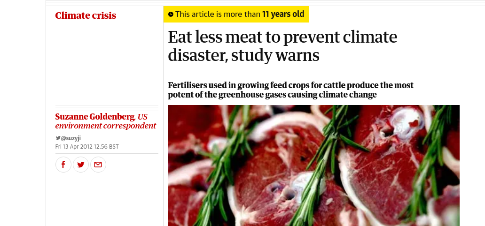
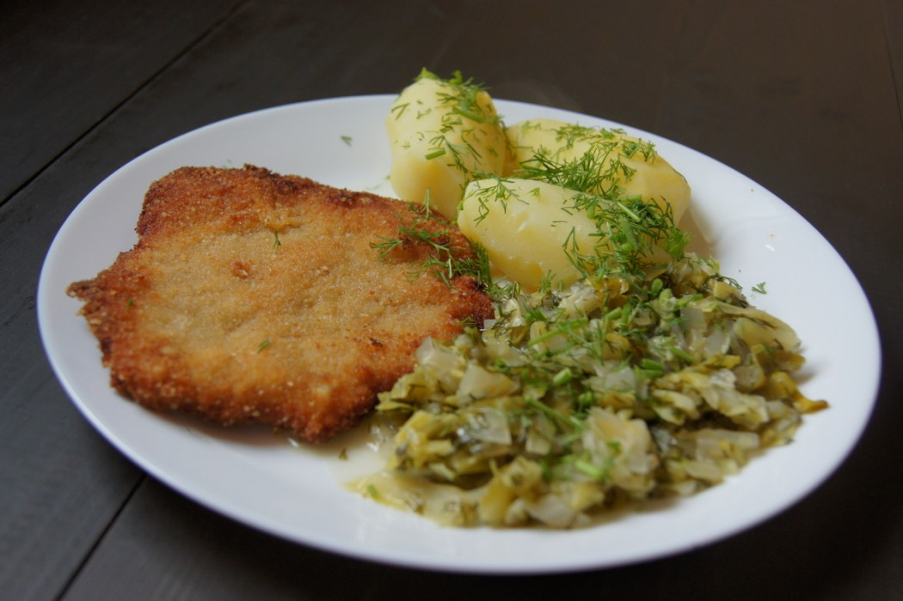

```{r setup, include=FALSE}
knitr::opts_chunk$set(echo = F, warning=F, message = F)

library("ggplot2")
library("dplyr")
library("tidyr")
library(knitr)

items.of.interest <- c( 'Meat', 'Animal Products', 'Grand Total', 'Population')
units.of.interest <- c('FoodS (kcal/c/d)', 'ProtSQ (g/c/d)', 
                       'FoodSQ (kg/c/y)', 'TotalPop')
years <- c('2010', '2020')

fao.aggregates <- c("001", "002", "014", "017", "015", "018", "011", "019",
"021", "013", "029", "005", "142", "143", "030", "034", "035", "145", "150",
"151", "154", "039", "155", "009", "053", "054", "097", "199", "432", "722",
"901", "902")
```

## Introduction

Why we should eat less meat?

* Because [consumption] it is unhealthy

* Because [production] is economically inefficient

* Because [production] is harmful to environment

The last argument is very 
popular recently. We should eat less meat to save the Earth

{width=80%}

Note the publication date: {width=3.5%}

## Data

There is such a beast as FAO food balance sheet

Data on per capita supply at a retail level of various food items

Calculate as: 

(production + import + stocks) - (export + feeding/non-food-usage/wastage + closing stocks)

The difference divided by population is per capita consumption

The balance is mantained from 1961 but in 2010 there was
a methodology change

Up to you to assess the precision :-)

## FBS

Items (hundreds) and item groups (such as Meat or Animal Products)

Measured as: daily per capita energy supply (kcal/c/d),
daily per capita protein supply (g/c/d),
daily per capita fat supply (g/c/d),
or
daily per capita quantity supply (kg/c/year)

We use the following item groups: Meat, Animal Products
(Meat + Eggs + Dairy products, Honey etc...),
Total Products (ie. total per capita consumption)

https://www.fao.org/faostat/en/#data/FBS


## Results

We enhance FBS with GDP data from the World Bank and use
World Bank Income Groups

GNI per capita, Atlas method (current USD)
https://data.worldbank.org/indicator/NY.GNP.PCAP.CD

 GNI         | Income Group
-------------+--------------
 0–1084      | low 
 1085–4254   | lower-middle
 4255–13204  | upper-middle
 13205–      | high
-------------+--------------

```{r}
o0 <- read.csv(file='FoodBalance2023.csv',sep=';', 
               colClasses=c( CodeM49 ="character"),
               header=T) %>%
  filter (YearCode %in% years ) %>%
  filter (Item %in% items.of.interest) %>%
  filter (Element %in% units.of.interest)
 
## około 130 krajów o liczbie ludności > 3mln (w 2020)
## pull zamienia na listę
big.countries.2020 <- o0 %>% filter(YearCode == 2020 ) %>%
   filter (Item == 'Population' & Value > 3000) %>%
    filter (! CodeM49 %in% fao.aggregates) %>%
  pull(CodeM49)

o1 <- o0 %>% filter (CodeM49 %in% big.countries.2020) 
```

We omit countries with population less than 3 mln. 

```{r}
gni0 <- read.csv(file='API_NY.GNP.PCAP.CD_DS2_en_csv_v2_5340976.csv', 
               sep=',', 
               ##colClasses=c( CodeM49 ="character"),
               header=T) %>%
  select (ISO3=Country.Code, starts_with('X')) %>%
  pivot_longer(cols = starts_with('X'), names_prefix = 'X', names_to = 'year',
               values_to = 'GNI') %>%
  mutate (year = as.numeric(year)) %>%
  drop_na() %>%
  group_by(ISO3) %>%
  summarise(ISO3 = last(ISO3), year = last(year), GNI = last (GNI))


## UNSD nie zawiera taiwanu
## unsd potrzebny do dodania ISO3
#unsd <- read.csv(file='m49toIso.csv', sep=';',
#                 colClasses=c( M49 ="character"), header=T) %>%
#  select (CountryName, CodeM49=M49, ISO3)
unsd <- read.csv(file='m49toIso.csv', sep=';',
                 colClasses=c( M49 ="character"), header=T) %>%
  select (CountryName, CodeM49=M49, ISO3, UE)
unsd.ue <- unsd %>% filter (UE == "Y") %>%
  select (CodeM49) %>% unlist %>% unname()


o2 <- o1 %>% 
  left_join(unsd, by='CodeM49' ) %>%
  left_join(gni0, by=c('ISO3'='ISO3')) %>%
  #mutate( class=IncomeGroup)
  mutate( class=case_when( GNI < 1085 ~ "low",
                           GNI < 4255 ~ "lower-middle",
                           GNI < 13205 ~ "upper-middle",
                           GNI >= 13205 ~ "high",
                           TRUE ~ NA_character_ ) ) %>%
  drop_na(class)
```

```{r}
o2.high <- o2 %>% group_by(Area) %>%
  summarise(Area=last(Area), class=last(class)) %>%
  filter (class=='high')
N.high <- nrow(o2.high)

o2.lm <- o2 %>% group_by(Area) %>%
  summarise(Area=last(Area), class=last(class)) %>%
  filter (class=='lower-middle')
N.lm <- nrow(o2.lm)

o2.um <- o2 %>% group_by(Area) %>%
  summarise(Area=last(Area), class=last(class)) %>%
  filter (class=='upper-middle')
N.um <- nrow(o2.um)

o2.low <- o2 %>% group_by(Area) %>%
  summarise(Area=last(Area), class=last(class)) %>%
  filter (class=='low')
N.low <- nrow(o2.um)
```

There is `r N.high` countries in high-income group;
`r N.um` countries in upper-middle-income group;
`r N.lm` countries in lower-middle-income group
and 
`r N.low` countries in low-income group.


## Population

```{r}
p.pop <- o2 %>%
  filter (Item == 'Population') %>%
  group_by(class, YearCode) %>%
  summarise(population = sum(Value, na.rm = T)) %>%
  group_by(YearCode) %>%
  mutate(T = sum(population)) %>%
  group_by(class, YearCode) %>%
  summarise(p = sum(population) / T * 100 ) 

## sprawdzenie
##p.pop.total <- p.pop %>%
##  group_by(YearCode) %>%
##  summarise(p=sum(p))
##

p.pop.p1 <- p.pop %>% ggplot(aes(x = class, y = p)) +
  facet_wrap(~YearCode) +
  ggtitle("World population by WB income classes") +
  geom_bar(stat='identity',  fill = "navyblue")  +
  geom_text(aes(label = sprintf ("%.1f", p)), size=3, color='white', vjust=1.5)
p.pop.p1
```


## Meat Consumption 

```{r}
p0 <- o2 %>% 
  filter (Item == 'Meat' & Element =='FoodSQ (kg/c/y)' ) %>%
  ggplot(aes(x=class, y=Value)) +
  facet_wrap(~YearCode) +
  geom_jitter(size=3, alpha=.3, position=position_jitter(0.05)) +
  geom_boxplot(outlier.shape = NA, alpha=.3, fill='yellow') +
  ylab("kg/capita/year") +
  ggtitle("Meat consumption (kg/capita/year)", subtitle="")

p0

p1 <- o2 %>% 
  filter (Item == 'Meat' & Element =='FoodS (kcal/c/d)' ) %>%
  ggplot(aes(x=class, y=Value)) +
  facet_wrap(~YearCode) +
  geom_jitter(size=3, alpha=.3, position=position_jitter(0.05)) +
  geom_boxplot(outlier.shape = NA, alpha=.3, fill='yellow') +
  ylab("kcal/capita/day") +
  ggtitle("Meat consumption (kcal/c/d)", subtitle="")

p1
```

## Animal Products consumption

```{r}
p2 <- o2 %>% drop_na(class) %>%
  filter (Item == 'Animal Products' & Element =='FoodS (kcal/c/d)' ) %>%
  ggplot(aes(x=class, y=Value)) +
  facet_wrap(~YearCode) +
  geom_jitter(size=3, alpha=.3, position=position_jitter(0.05)) +
  geom_boxplot(outlier.shape = NA, alpha=.3, fill='yellow') +
  ylab("kcal/capita/day") +
  ggtitle("Animal products consumption (kcal/c/d)", subtitle="")

p2
```

## Total consumption

```{r}
p3 <- o2 %>% 
  filter (Item == 'Grand Total' & Element =='FoodS (kcal/c/d)' ) %>%
  ggplot(aes(x=class, y=Value)) +
  facet_wrap(~YearCode) +
  geom_jitter(size=3, alpha=.3, position=position_jitter(0.05)) +
  geom_boxplot(outlier.shape = NA, alpha=.3, fill='yellow') +
  ylab("kcal/capita/day") +
  ggtitle("Total consumption (kcal/c/d)", subtitle="")

p3
```

## Protein supply

```{r}
p1.prot <- o2 %>% 
  filter (Item == 'Meat' & Element =='ProtSQ (g/c/d)' ) %>%
  ggplot(aes(x=class, y=Value)) +
  facet_wrap(~YearCode) +
  geom_jitter(size=3, alpha=.3, position=position_jitter(0.05)) +
  geom_boxplot(outlier.shape = NA, alpha=.3, fill='yellow') +
  ylab("kcal/capita/day") +
  ggtitle("Meat Protein supply (kcal/c/d)", subtitle="")

p1.prot

p2.prot <- o2 %>% 
  filter (Item == 'Animal Products' & Element =='ProtSQ (g/c/d)' ) %>%
  ggplot(aes(x=class, y=Value)) +
  facet_wrap(~YearCode) +
  geom_jitter(size=3, alpha=.3, position=position_jitter(0.05)) +
  geom_boxplot(outlier.shape = NA, alpha=.3, fill='yellow') +
  ylab("kcal/capita/day") +
  ggtitle("Animal products protein supply (kcal/c/d)", subtitle="")

p2.prot


p3.prot <- o2 %>% 
  filter (Item == 'Grand Total' & Element =='ProtSQ (g/c/d)' ) %>%
  ggplot(aes(x=class, y=Value)) +
  facet_wrap(~YearCode) +
  geom_jitter(size=3, alpha=.3, position=position_jitter(0.05)) +
  geom_boxplot(outlier.shape = NA, alpha=.3, fill='yellow') +
  ylab("kcal/capita/day") +
  ggtitle("Total protein supply (kcal/c/d)", subtitle="")

p3.prot
```


## Total Consumption of meat


```{r}
## kg/pc/year
o2t <- o2 %>%
  filter (Item =='Population' | (Item == 'Meat' & Element =='FoodSQ (kg/c/y)' )) %>%
  select (CodeM49, class, Item, Value, YearCode)  %>%
  pivot_wider(names_from = Item, values_from = Value) %>%
  mutate (tc = Population * Meat) %>%
  group_by(class, YearCode) %>%
  summarise(tc=sum(tc), tpop =sum(Population), pctc = tc/tpop) %>%
  ##
  group_by(YearCode) %>%
  mutate(T = sum(tc), TP = sum(tpop)) %>%
  group_by(class, YearCode) %>%
  summarise(p = sum(tc) / T * 100, pp = sum(tpop) / TP, pctc = first(pctc) ) 

o2t.p <- o2t %>% 
  ggplot(aes(x = class, y = pp)) +
  facet_wrap(~YearCode) +
  ggtitle("Meat consumption by Income Groups (% total)") +
  geom_bar(stat='identity',  fill = "navyblue")  +
  geom_text(aes(label = sprintf ("%.1f", p)), size=3, color='white', vjust=1.5)
o2t.p
  
o2t.pc <- o2t %>% 
  ggplot(aes(x = class, y = pctc)) +
  facet_wrap(~YearCode) +
  ggtitle("Average meat consumption by Income Gropus (kg/capita/year)") +
  geom_bar(stat='identity',  fill = "navyblue")  +
  geom_text(aes(label = sprintf ("%.1f", pctc)), size=3, color='white', vjust=1.5)
o2t.pc
```

## Total Consumption of Animal products

```{r}
## Consumption of animal products (total kcal/c/d)
o3t <- o2 %>%
  filter (Item =='Population' | (Item == 'Animal Products' & Element =='FoodS (kcal/c/d)' )) %>%
  select (CodeM49, class, Item, Value, YearCode)  %>%
  pivot_wider(names_from = Item, values_from = Value) %>%
   ###
  select (CodeM49, class, Population, Meat=`Animal Products`, YearCode) %>% 
  mutate (tc = Population * Meat) %>%
  group_by(class, YearCode) %>%
  summarise(tc=sum(tc), tpop =sum(Population), pctc = tc/tpop) %>%
  ##
  group_by(YearCode) %>%
  mutate(T = sum(tc), TP = sum(tpop)) %>%
  group_by(class, YearCode) %>%
  summarise(p = sum(tc) / T * 100, pp = sum(tpop) / TP, pctc = first(pctc) ) 

## Per capita change

o3r.pc.change <- o3t %>% select (class, YearCode, pctc) %>%
  pivot_wider(names_from = 'YearCode', values_from = 'pctc') %>%
  mutate (d = (`2020` - `2010`)/`2010` * 100, d1 = d/11)
 
o3t.p <- o3t %>% 
  ggplot(aes(x = class, y = pp)) +
  facet_wrap(~YearCode) +
  ggtitle("Animal products consumption bye Income Groups (% total)") +
  geom_bar(stat='identity',  fill = "navyblue")  +
  geom_text(aes(label = sprintf ("%.1f", p)), size=3, color='white', vjust=1.5)
o3t.p

o3t.pc <- o3t %>% 
  ggplot(aes(x = class, y = pctc)) +
  facet_wrap(~YearCode) +
  ggtitle("Animal products consumption by Income Groups (kcal/c/d)") +
  geom_bar(stat='identity',  fill = "navyblue")  +
  geom_text(aes(label = sprintf ("%.1f", pctc)), size=3, color='white', vjust=1.5)
o3t.pc
```

## Total consumption

```{r}
o4t <- o2 %>%
  filter (Item =='Population' | (Item == 'Grand Total' & Element =='FoodS (kcal/c/d)' )) %>%
  select (CodeM49, class, Item, Value, YearCode)  %>%
  pivot_wider(names_from = Item, values_from = Value) %>%
  ###
  select (CodeM49, class, Population, Meat=`Grand Total`, YearCode) %>% 
  mutate (tc = Population * Meat) %>%
  group_by(class, YearCode) %>%
  summarise(tc=sum(tc), tpop =sum(Population), pctc = tc/tpop) %>%
  ##
  group_by(YearCode) %>%
  mutate(T = sum(tc), TP = sum(tpop)) %>%
  group_by(class, YearCode) %>%
  summarise(p = sum(tc) / T * 100, pp = sum(tpop) / TP, pctc = first(pctc), 
            tc=first(tc)/1000000 )

o4t.pc <- o4t %>% 
  ggplot(aes(x = class, y = pctc)) +
  facet_wrap(~YearCode) +
  ggtitle("Average daily consumption (kcal/c/d)") +
  geom_bar(stat='identity',  fill = "navyblue")  +
  geom_text(aes(label = sprintf ("%.1f", pctc)), size=3, color='white', vjust=1.5)
o4t.pc

## 
o4t.tt <- o4t %>% 
  ggplot(aes(x = class, y = tc)) +
  facet_wrap(~YearCode) +
  ggtitle("Total daily consumption (millions kcal/d)") +
  geom_bar(stat='identity',  fill = "navyblue")  +
  geom_text(aes(label = sprintf ("%.1f", tc)), size=3, color='white', vjust=1.5)
o4t.tt 
  
o4t.total <- o4t %>%
  group_by(YearCode) %>%
  summarise(tc = sum(tc))
```

## Energy supply by food category

```{r}
o2t.energy <- o2 %>%
  filter (Item =='Population' | (Item == 'Meat' & Element =='FoodS (kcal/c/d)' )) %>%
  select (CodeM49, class, Item, Value, YearCode)  %>%
  pivot_wider(names_from = Item, values_from = Value) %>%
  mutate (tc = Population * Meat) %>%
  group_by(class, YearCode) %>%
  summarise(tc=sum(tc), tpop =sum(Population), pctc = tc/tpop) %>%
  ##
  group_by(YearCode) %>%
  mutate(T = sum(tc), TP = sum(tpop)) %>%
  group_by(class, YearCode) %>%
  summarise(p = sum(tc) / T * 100, pp = sum(tpop) / TP, pctc = first(pctc) )

o99t <- o2t.energy %>% select (class, YearCode, meat=pctc) %>%
  left_join(o3t, by=c('class', 'YearCode')) %>%
  select (class, YearCode, meat, animal=pctc) %>%
  left_join(o4t, by=c('class', 'YearCode')) %>%
  select (class, YearCode, meat, animal, total=pctc) %>%
  mutate (meatp=meat/total * 100, animalp=animal/total * 100)

energy.pc.table <- kable(o99t, digits = 1,
                         col.names = c('Group', 'Year', 'Meat', 
                                             'AnimalP', 'Total', 'Meat%†', 'AnimalP%†'))
energy.pc.table
```

† percent of total energy supply (kcal/c/d)

## Per capita vs total 

This is called **marimekko plot** (total consumption of meat (kg/c/y) by per capita consumption)

```{r, fig.width=9.5}

o2t.countries <- o2 %>%
  filter (Item =='Population' | (Item == 'Meat' & Element =='FoodSQ (kg/c/y)' )) %>%
  select (CodeM49, ISO3, class, Item, Value, YearCode)  %>%
  pivot_wider(names_from = Item, values_from = Value) %>%
  mutate (tc = Meat) %>%
  group_by(ISO3, YearCode) %>%
  summarise(c = last(tc), pop = last(Population), class=last(class) ) %>%
  filter (YearCode == 2020) %>%
  ungroup()
  
fbs90 <- o2t.countries %>% arrange (c) %>%
  mutate( ww = cumsum(pop)) %>%
  mutate( wm = ww - pop) %>%
  mutate( wt = wm + (ww - wm)/2) %>%
  mutate (isoh = as.character(ISO3), isol = as.character(ISO3), 
          isoll=as.character(ISO3))

## only big countries (> 50 mln)
fbs90$isoh[ (fbs90$pop < 49999) ] <- ""
##
p9  <- ggplot(fbs90, aes(ymin = 0)) +
  ylab(label="meat consumption PC") +
  xlab(label="world population (mln)") +
  ggtitle(sprintf("World meat consumption by country 2020"),
          subtitle="source: FAO food balance") +
  geom_rect(aes(xmin = wm, xmax = ww, ymax = c, fill = class), color='gold', size=.2) +
  ##
  geom_text(aes(x = wt, y = 0, label = isoh), vjust=+0.5, hjust=+1.25, size=2.1, angle = 90) +
 
  ## Ucina labele bez ylim
  ylim(-6, NA) +
  labs(fill="Income Group:") +
  theme(legend.position = "top")
p9

```

MMR -- Myanmar

## Schabowy Raz

Kotlet schabowy (KOHT-let s-HA-bow-vey):
in its most traditional form, this pork cutlet is coated with breadcrumbs,
fried on lard, and served with potatoes and browned or pickled cabbage. 
https://culture.pl/en/work/polish-food-101-kotlet-schabowy



Non-halal in classical form but poultry variant is also popular

And do not forget about *kiełbasa* (sausage)

```{r}
o.pl <- o0 %>% filter (CodeM49 == '616') %>%
  filter (Item == 'Meat' & Element =='FoodSQ (kg/c/y)' ) 
pl.cons.2010 <- o.pl %>%
  filter(YearCode == '2010' ) %>%
  select(Value) %>% 
  unlist() %>%
  unname() 
pl.cons.2020 <- o.pl %>%
  filter(YearCode == '2020' ) %>%
  select(Value) %>% 
  unlist() %>%
  unname() 

o.ue <- o0 %>% filter (CodeM49 %in% unsd.ue) %>%
  filter (Item == 'Meat' & Element =='FoodSQ (kg/c/y)' ) 

o.ue.total <- o.ue %>%
  group_by(YearCode) %>%
  summarise( Value = mean(Value)) %>%
  ungroup()


ue.cons.p <- ggplot(o.ue, aes(x= Area,  y=Value, fill=as.factor(YearCode) )) +
  geom_bar(stat='identity', position="identity",  alpha=.3) +
  xlab(label="") +
  ylab("kg/capita/year") +
  theme(legend.position = "top") +
  labs(fill="") +
  ggtitle('Consumption of meat in EU (2020 vs 2010') +
  coord_flip()

ue.cons.p
```

PL/POL meat consumption: `r pl.cons.2010` (2010) vs `r pl.cons.2020` (2020) kg/pc/year

## Environmental Kuznets Curve

The environmental Kuznets curve (EKC) is a hypothesized relationship
between various indicators
of environmental degradation and per capita
income.

In the early stages of economic growth, pollution emissions
increase and environmental quality declines, but beyond some level
of per capita income the trend reverses, so that at high income levels,
economic growth leads to environmental improvement.

https://www.sciencedirect.com/topics/earth-and-planetary-sciences/environmental-kuznets-curve

In case of meat consumption and the most basic form the relation
can be specified as:

Meat = a + b · GDP + c · GDP²

If a relation between Meat consumption and GDP follows EKC
it must has a turning point, ie. an income level above which
the consumption of meat decreases.

## Environmental Kuznets Curve cd

Simple regressions

```{r}
## GDP NY.GNP.PCAP.CD = GNI per capita
## Gross National Income
z0 <- read.csv(file='API_NY.GNP.PCAP.CD_DS2_en_csv_v2_5340976.csv', 
               sep=',', header=T) %>%
  select (ISO3=Country.Code, starts_with('X')) %>%
  pivot_longer(cols = starts_with('X'), names_prefix = 'X', names_to = 'year',
               values_to = 'gnp') %>%
  filter (year %in% years ) 

## GNI in ths
o2x <- o2 %>% mutate (GNI = GNI / 1000 )
##%>% left_join(u0, by=c('ISO3', 'YearCode'='year'))

o2xx <- o2x %>% filter (YearCode == 2020) %>%
  filter (Item == 'Grand Total' & Element =='FoodS (kcal/c/d)' )

f1 <- ggplot(o2xx, aes(x= GNI,  y=Value )) +
  geom_point(size=2.5, alpha=.3) +
  geom_smooth(method = lm) +
  xlab(label="") +
  ggtitle("Total energy supply 2020 (kcal/c/d)") +
facet_wrap(~ class, scales = "free" )

f1

####### Animal products

o2xx <- o2x %>% filter (YearCode == 2020) %>%
  filter (Item == 'Animal Products' & Element =='FoodS (kcal/c/d)' )

f2 <- ggplot(o2xx, aes(x= GNI,  y=Value )) +
  geom_point(size=2.5, alpha=.3) +
  geom_smooth(method = lm) +
  xlab(label="") +
  ggtitle("Animal products supply 2020 (kcal/c/d)") +
  facet_wrap(~ class, scales = "free" )

f2
```

## EKC, linear regression

GDP/GNI per capita (GDP NY.GNP.PCAP.CD) versus 
**Animal products supply 2020 (kcal/c/d)**

Linear regression: Meat = a + b · GNI


```{r}
model0 <- lm(data=o2xx, Value ~ GNI  )
model0.sum <- summary(model0)
##model0.sum
lmc <- coef(model0);
lmr.m0 <- sprintf ("%.1f", model0.sum$r.squared * 100)
b.coeff <- sprintf ("%.1f", lmc["GNI"] )
a.coeff <- sprintf ("%.1f", lmc["(Intercept)"])


p.lm <- ggplot(o2xx, aes(GNI, Value) ) + geom_point() +
  stat_smooth(method = lm) 
p.lm

```

Meat = `r a.coeff` + `r b.coeff` GNI (1000 USD/pc; R² = `r lmr.m0`)


## EKC, polynominal (quadratic) regression

Meat = a + b · GDP + c · GDP²

```{r}
model1 <- lm(data=o2xx, Value ~ GNI + I(GNI^2) )
model1.sum <- summary(model1)

lmc <- coef(model1);
lmr.m1 <- sprintf ("%.1f", model1.sum$r.squared * 100)
##
c.coeff <- sprintf ("%.1f", lmc[3])
b.coeff <- sprintf ("%.1f", lmc[2])
a.coeff <- sprintf ("%.1f", lmc[1])
##
apex <- coef(model1)[2] / (-2*coef(model1)[3])
apex.y <- coef(model1)[1] + coef(model1)[2] * apex + coef(model1)[3] * apex^2

## https://www.geeksforgeeks.org/polynomial-regression-in-r-programming/
##apex.y
p.kuznets <- ggplot(o2xx, aes(GNI, Value) ) + geom_point() +
  stat_smooth(method = lm, formula = y ~ poly(x, 2)) +
  annotate("point", x = apex, y = apex.y, colour = "red", size=4) +
  annotate("text", x = apex, y = apex.y, colour = "red", size=4, 
           label=sprintf ("%.1f", apex), vjust=2)

p.kuznets

```

Meat = `r a.coeff` + `r b.coeff` · GNI  + `r b.coeff` · GNI² (1000 USD/pc; R² = `r lmr.m1`)

Apex point is `r sprintf ("%.1f", apex.y)` kcal/c/daily 
of Animal Products at  `r sprintf ("%.1f", apex)` USD/pc. 

This is very high value but is consistent with **Cole J.R. and McCoskey S. (2017)**
who using data for 2009 reported 43,9 thousand/pc.

## Conclusion

We are doomed


## Bibliography

Cole J.R., McCoskey S.,
*Does global meat consumption follow an environmental Kuznets curve*
Sustainability: Science, Practice, and Policy 9/2 (2017), pp. 26--36
https://www.tandfonline.com/doi/abs/10.1080/15487733.2013.11908112

Sans P., Combris P.,
*World meat consumption patters: An overview of the last fifty years (1961--2011)*
Meat Science 2015

Przechlewski T.,
*Meat and animal products consumption trends 2010--2020. Exploratory analysis*
Oblicza Dobrobytu 2023 (In Press)
https://github.com/hrpunio/Papers/tree/main/PSW_2023
